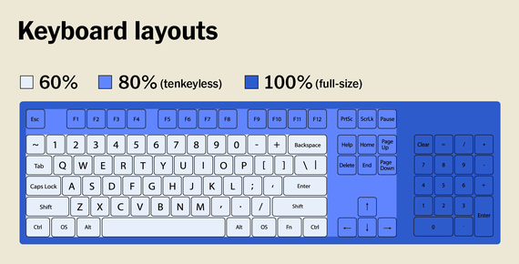
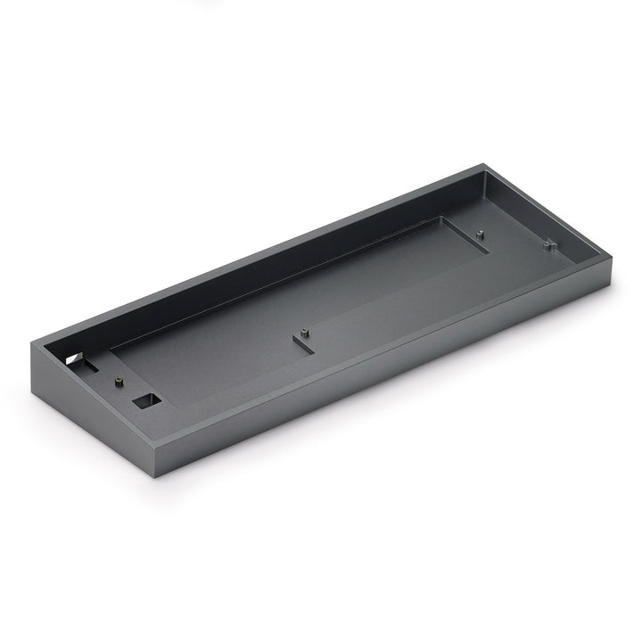
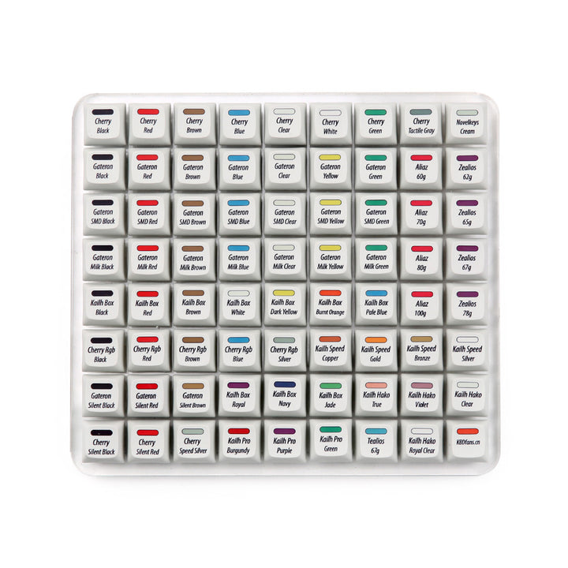
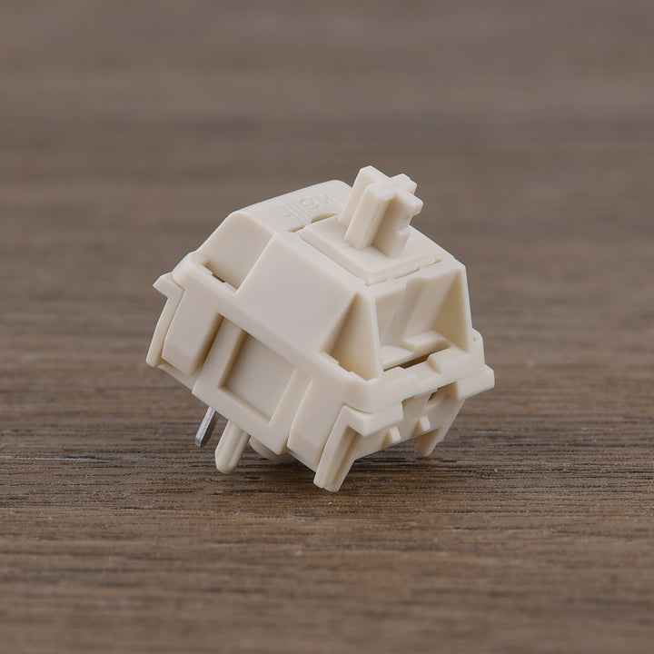
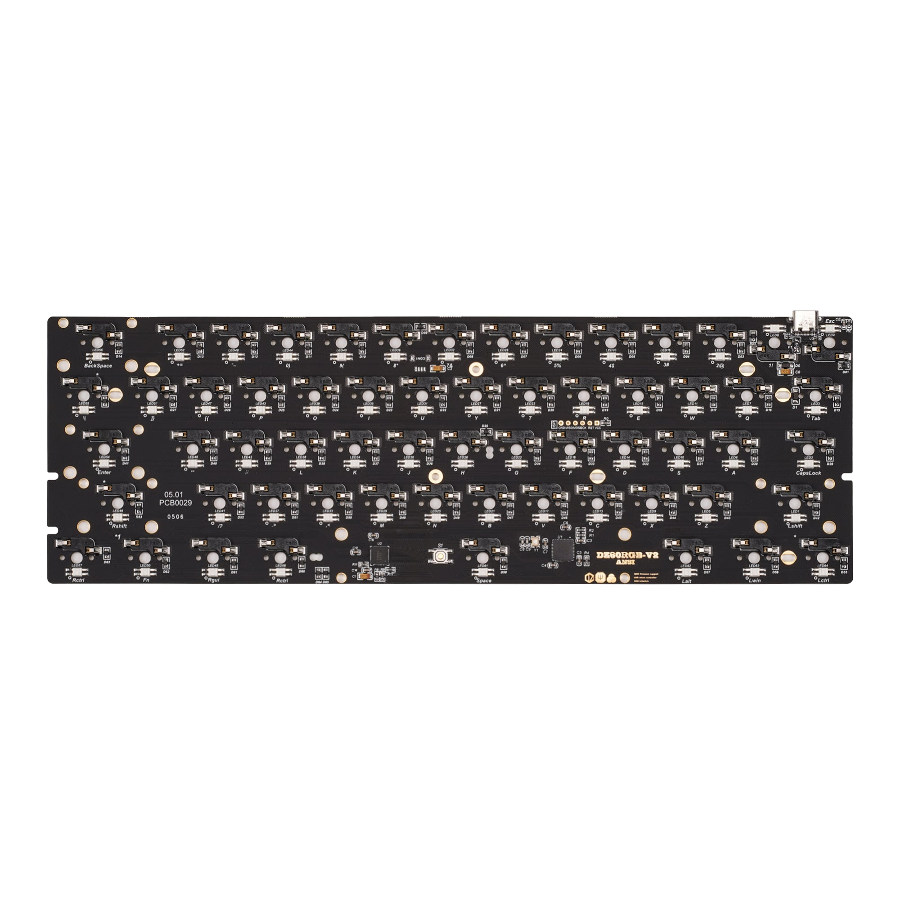
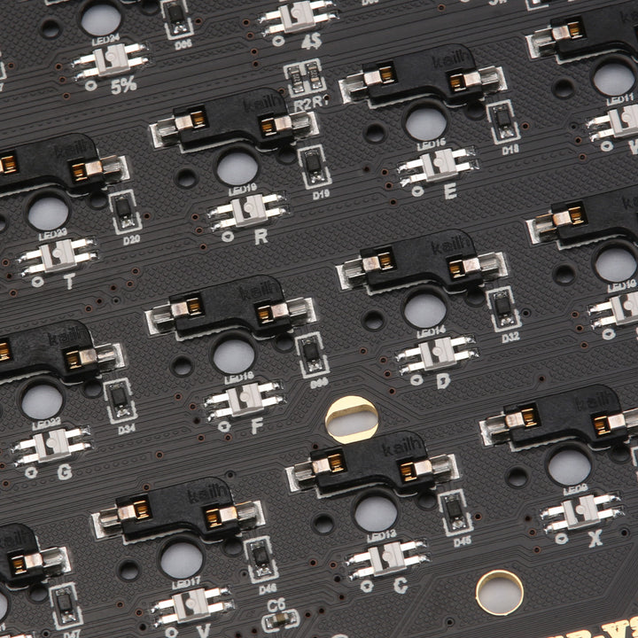

```{r setup, include=FALSE}
knitr::opts_chunk$set(echo = FALSE)
#### Setup workspace ####
# install.packages("opendatatoronto")
# install.packages("tidyverse")
# install.packages("ggplot2")
# install.packages("knitr")
# install.packages("here")
# install.packages("kableExtra") 
# install.packages('reshape2')
# install.packages("haven")
# install.packages("scales")

library(tidyverse)
library(knitr)
library(here)
library(kableExtra)
library(reshape2)
library(haven)
library(scales)
library(distill)
```

I have always used different types of keyboards throughout my life. Keyboards from an iMac, from a MacBook, on a Microsoft Surface Pro, and even the typical bog standard keyboard from Dell. These keyboards were usually pretty crappy, as they would be fairly unsatisfying to type on, leading to a lackluster typing experience. So during lockdown, I watched many people who display and talk about their entire process in building their own keyboard from scratch. People like [Taeha Types](https://www.youtube.com/taehatypes) and [Hipyo Tech](https://www.youtube.com/c/HipyoTech) showcase their skills in building high-end custom mechanical keyboards, looking into how each component effectively combine together to produce one cohesive product that is custom built for the client. This area of the market is very niche, as most components are produced in low quantities, creating many difficulties throughout the entire process, and I wanted to share how my experience ended up in some victories and some failures. 

In my case, I wanted to build something that was much more quiet and effectively easy to type with, as I wanted something that could last me years and years. So I started looking for different parts over several months. The key parts that I would need to look into purchasing would be:

* Outer Case: To house all of the components.
* PCB: the brains of the keyboard, including the component used to communicate with the computer.
* Switches: the part that makes up each key of the keyboard.
* Key caps: the part that goes on top of the switch to actuate the switch
* Plate: the skeleton of the keyboard, as it'll align the switches properly to the PCB, as well as provide a sturdy place for it to anchor onto.

Other optional parts that I purchased on the side would include:

* Lubricants: there are particular brands of Lubricants that are used in car manufacturing, that is used to enhance the typing experience
* Stabilizers: though this may be included in basic kits, there are specialized stabilizers that can be purchased that are tuned by the manufacturer to enhance the typing experience.
* Small Paintbrushes: used to apply lubricant to multiple areas of the keyboard. 

# Brainstorming the Parts
Before I got to building, I had to go through and understand what parts I wanted to buy before going straight into getting the parts shipped to me. I had to understand what each part brought to the table and how each part contributed to the final product. Though this was a very tedious task, I was able to go through and understand the significance of each part to the keyboard. 
The first thing I had to consider was the outer case that would house all the different components. Through looking at multiple videos on YouTube, as well as looking into different forums that talked about these parts. A very popular discussion forum, [geekhack](https://geekhack.org/index.php), was used to learn in depth considerations of different parts of the keyboard, as many people would discuss the pros and cons that they personally thought of each part. The most important thing I've learned throughout this process, was that each person had their own preference, and that take everything the internet says with a grain of salt. Though the internet did help me a lot in terms of the decisions I had to make, I was overwhelmed with the different choices that were available to me. At the end, I chose to build in the 60% layout, as that was the layout that had largest amount of availability on different sites. Layout here represents how big the overall keyboard, and the picture here will show the differences between the different sizes. I ended up buying the Tofu case from KBDFans, as they were a reputable company that supply generic custom parts. This case had a generic astetic to the overall look, with a sortof sophisticated styling to it. This came with multiple components that I needed, such as the plate, which was all black, and stabilizers for some of the longer keys.





Though I didn't use this, I highly recommend anyone who is trying to make their first keyboard, to get a switch tester (Like this one: [https://kbdfans.com/collections/switches-tester/products/kbdfans-72-switches-tester-all-in-one](https://kbdfans.com/collections/switches-tester/products/kbdfans-72-switches-tester-all-in-one)), as this will allow you to test out multiple types of switches from different companies to see what you like the most. In my case, the switch I had chosen beforehand wasn't available on the switch tester, I had to trust the internet, as well as the hype that was on YouTube, when TaehaTypes built a keyboard for Streamer Tfue. So I ended up with NovelKey Creams, for their deep sounding 'thock'. Here is a typing video of the switch I got. ([NK Creams Sound Test](https://www.youtube.com/watch?v=P6gW18XE6EM))




As for the PCB, I was stuck between two major types of PCB for the 60% keyboard case that I had chosen. I would have the choice of a hotswap PCB, which has specialized sockets in each switch hole that allows for the plug and play of the switch, as well as the choice of a PCB that required soldering, which needed solder to connect the switch to the PCB for connectivity. In my case, hotswap PCBs were unavailable as a separate purchase, which forced me to purchase a soldered PCB.


Finally, I needed to buy some of the tuning equipment for the keyboard switches and stabilizers. I already owned a small paint brush, so I skipped on that, but I still needed to purchase the lubricant. Many sources says that "The type of lube you choose can make or break how well your keyboard performs, so we’ll walk you through our favorite options.", and so there are two particularly famous types of switch lube that people tend to use: Krytox and Tribosys. Though which type of lube come down to personal preference, linear switches like the NovelKey Creams that I chose should use Krytox 205G0, which is a fairly thick lubricant that gives the switch a smooth and buttery feel to it. Many keyboard enthusiasts live by lubricating their switches, which involve opening up each and every switch, and applying small amount of lube onto any surface that comes into contact with another piece. Lubricating surfaces that touch and move along each other can reduce friction and make the switches and stabilizers glide smoother, essentially making parts that scratch against each other rub smoothly and more quietly. I followed TaehaTypes introduction to how to lube switches, which was a daunting task that essentially took me 2 days of intermittent focus to finish preparing the switches. 

# The Building Process
After receiving all the different parts in the span of 2 months, I ended up preparing the switches and testing the PCB before starting. I painstakingly put every single switch into each of the holes in the PCB with the plate in between, as well as adding a layer of foam in between the plate and the PCB, as this was recommended to lessen the noise of the keyboard. This step also included installing the stabilizers, which required a bit of lube as well. After soldering each switch twice, as there are 2 soldering points on each switch, I tested every single key a couple of times to make sure I was done, before finally screwing in the small Philips-head screws, putting the key caps onto each key and ended up with my final product. 


# Takeaway
Overall the entire process was fun and enjoyable, as it taught me things like how to solder joints, and what happens when you head up the PCB too much, as I almost burnt my PCB, when I applied too much heat. I would suggest people to try other people's custom keyboards before finalizing what you want to build as that'll give you a taste of what your end product can be. Though each person's custom keyboard is slightly different, it's these differences that can bring flavour into your personal gear. Beware the rabbit hole you are about to head into, as this is not a cheap hobby. The final cost of the keyboard came to about $200 CAD, which is on the cheap end for custom keyboards. I want to say that one is enough for a lifetime, but I somehow found the reason to get another one!